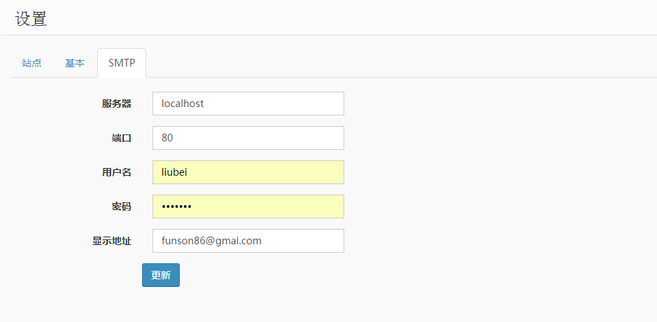

Yii2 Setting
=========
Yii2 Setting for other application, especially for [Yii2 Adminlte](https://github.com/funson86/yii2-adminlte)

Installation
------------

The preferred way to install this extension is through [composer](http://getcomposer.org/download/).

Either run

```
php composer.phar require --prefer-dist funson86/yii2-setting "*"
```

or add

```
"funson86/yii2-setting": "*"
```

to the require section of your `composer.json` file.


Usage
-----

Once the extension is installed, simply use it in your code by  :

### Migration

Migration run

```php
yii migrate --migrationPath=@funson86/setting/migrations
```

### Config url rewrite in /common/config/main.php
```php
    'components' => [
        'settings' => [
            'class' => 'funson86\setting\Settings',
        ],
    ],
```

### Config backend modules in backend/config/main.php

```php
    'modules' => [
        'setting' => [
            'class' => 'funson86\setting\Module',
            'controllerNamespace' => 'funson86\setting\controllers'
        ],
    ],
```


### Config at backend
backend : http://you-domain/backend/web/setting

### Add Your Setting
Settings support 3 type of setting: text, password, select.
You could add your setting by migration or insert to table `setting` manually.
```php
INSERT INTO `setting` (`id`, `parent_id`, `code`, `type`, `store_range`, `store_dir`, `value`, `sort_order`) VALUES
(1111, 11, 'siteName', 'text', '', '', 'Your Site', '50'),
(3114, 31, 'smtpPassword', 'password', '', '', '', '50'),
(2112, 21, 'commentCheck', 'select', '0,1', '', '1', '50');
```

### Use Your Setting
Once you set the value at the backend. Simply access your setting by the following code:

```php
echo Yii::$app->settings->get('siteName');
```

Preview:
-------

